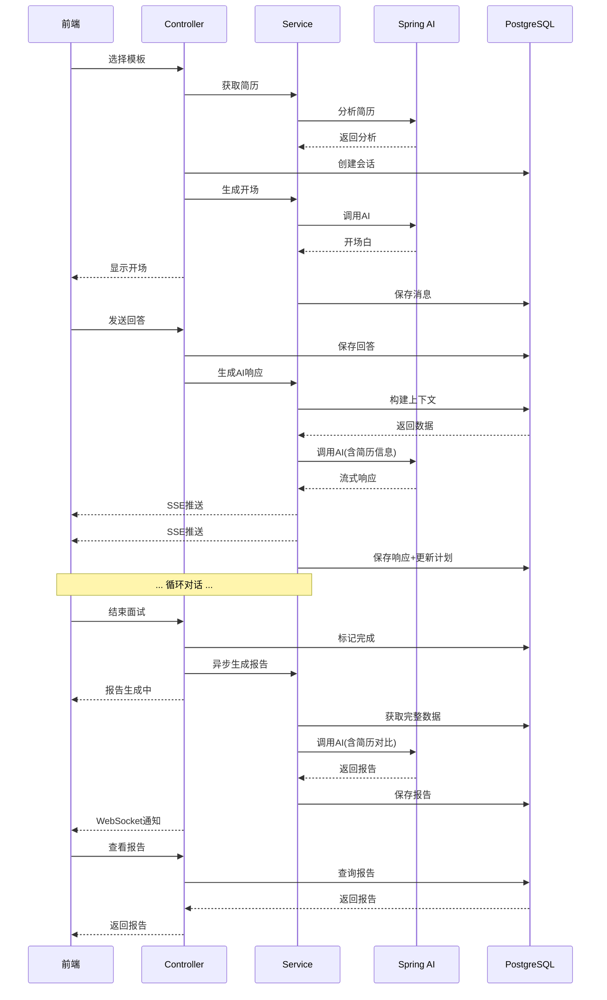

# AI模拟面试完整流程说明 (Spring AI + 简历版)

## 📋 流程总览

```
用户选择模板 → 解析简历 → 创建会话 → AI定制开场 → 多轮对话 → AI判断流程 → 结束面试 → 生成报告
```

------

## 阶段零: 简历数据准备

### 0.1 简历数据结构

```java
/**
 * 用户简历数据传输对象
 */
@Data
public class UserResumeDTO {

    /**
     * 姓名，最大长度50个字符
     */
    @Size(max = 50)
    private String name;

    /**
     * 出生日期
     */
    private LocalDate birth;

    /**
     * 性别
     */
    private GenderTypeEnum gender;

    /**
     * 所在地区信息
     */
    @Valid
    private Location location;

    /**
     * 教育背景信息
     */
    @Valid
    private Education education;

    /**
     * 联系方式信息
     */
    @Valid
    private Contact contact;

    /**
     * 工作经历信息
     */
    @Valid
    private Work work;

    /**
     * 技能列表，每个技能最大长度50个字符
     */
    private List<@Size(max = 50) String> skills;

    /**
     * 求职意向，最大长度100个字符
     */
    @Size(max = 100)
    private String jobIntention;

    /**
     * 自我评价，最大长度1000个字符
     */
    @Size(max = 1000)
    private String selfEvaluation;

    /**
     * 简历文件URL，最大长度255个字符
     */
    @Size(max = 255)
    private String resumeFileUrl;

    /**
     * 地区信息
     */
    @Data
    public static class Location {
        /**
         * 省份，最大长度50个字符
         */
        @Size(max = 50)
        private String province;

        /**
         * 城市，最大长度50个字符
         */
        @Size(max = 50)
        private String city;
    }

    /**
     * 教育背景信息
     */
    @Data
    public static class Education {
        /**
         * 学历等级，最大长度30个字符
         */
        @Size(max = 30)
        private String level;

        /**
         * 学校名称，最大长度100个字符
         */
        @Size(max = 100)
        private String school;

        /**
         * 专业，最大长度50个字符
         */
        @Size(max = 50)
        private String major;

        /**
         * 毕业时间
         */
        private YearMonth graduationDate;
    }

    /**
     * 联系方式信息
     */
    @Data
    public static class Contact {
        /**
         * 手机号码，最大长度20个字符
         */
        @Size(max = 20)
        private String phone;

        /**
         * 邮箱地址，最大长度100个字符
         */
        @Email
        @Size(max = 100)
        private String email;

        /**
         * 个人主页，最大长度255个字符
         */
        @Size(max = 255)
        private String homepage;
    }

    /**
     * 工作经历信息
     */
    @Data
    public static class Work {
        /**
         * 首次就业时间
         */
        private YearMonth firstEmployment;

        /**
         * 工作经历列表
         */
        @Valid
        private List<WorkExperience> experience;

        /**
         * 项目经历列表
         */
        @Valid
        private List<ProjectExperience> projects;
    }

    /**
     * 工作经历详情
     */
    @Data
    public static class WorkExperience {
        /**
         * 公司名称，最大长度100个字符
         */
        @Size(max = 100)
        private String company;

        /**
         * 职位，最大长度100个字符
         */
        @Size(max = 100)
        private String title;

        /**
         * 开始时间
         */
        private YearMonth startDate;

        /**
         * 结束时间
         */
        private YearMonth endDate;

        /**
         * 工作描述，最大长度1000个字符
         */
        @Size(max = 1000)
        private String description;
    }

    /**
     * 项目经历详情
     */
    @Data
    public static class ProjectExperience {
        /**
         * 项目名称，最大长度100个字符
         */
        @Size(max = 100)
        private String name;

        /**
         * 项目角色，最大长度100个字符
         */
        @Size(max = 100)
        private String role;

        /**
         * 项目描述，最大长度1000个字符
         */
        @Size(max = 1000)
        private String description;

        /**
         * 项目亮点列表，每个亮点最大长度100个字符
         */
        private List<@Size(max = 100) String> highlights;
    }
}

```

### 0.2 简历摘要提取

在创建面试会话前,先调用AI提取简历关键信息:

```java
@Service
public class ResumeAnalysisService {
    
    @Autowired
    private ChatClient chatClient;
    
    public ResumeAnalysis analyzeResume(ResumeDTO resume) {
        String prompt = String.format("""
            请分析以下候选人简历,提取关键信息用于定制化面试。
            
            候选人信息:
            姓名: %s
            教育背景: %s - %s - %s
            工作年限: %d年
            当前/最近职位: %s @ %s
            技能栈: %s
            求职意向: %s
            
            工作经历:
            %s
            
            项目经历:
            %s
            
            请以JSON格式返回:
            {
                "workYears": 5,
                "currentLevel": "high_senior",  // junior/mid/senior/high_senior
                "technicalStack": ["Python", "GoLang", "Kafka"],
                "strongAreas": ["分布式系统", "高并发"],
                "weakAreas": ["前端技术", "算法竞赛"],
                "interviewFocusPoints": [
                    "实时推荐系统的架构设计",
                    "Flink流处理实战经验",
                    "大规模分布式系统挑战"
                ],
                "suggestedQuestions": [
                    "请详细介绍实时推荐系统的技术架构",
                    "如何优化Flink任务的性能"
                ]
            }
            """,
            resume.getName(),
            resume.getEducation().getLevel(),
            resume.getEducation().getMajor(),
            resume.getEducation().getSchool(),
            calculateWorkYears(resume.getWork().getFirstEmployment()),
            resume.getWork().getExperience().get(0).getTitle(),
            resume.getWork().getExperience().get(0).getCompany(),
            String.join(", ", resume.getSkills()),
            resume.getJobIntention(),
            formatExperience(resume.getWork().getExperience()),
            formatProjects(resume.getWork().getProjects())
        );
        
        String response = chatClient.call(prompt);
        return parseResumeAnalysis(response);
    }
    
    private int calculateWorkYears(String firstEmployment) {
        LocalDate first = LocalDate.parse(firstEmployment);
        return Period.between(first, LocalDate.now()).getYears();
    }
}
```

------

## 阶段一: 初始化面试会话 (含简历信息)

### 1.1 用户操作

- 用户选择面试类型(前端/后端/全栈等)
- 系统自动获取用户的简历数据

### 1.2 后端处理流程

```java
@Service
public class InterviewSessionService {
    
    @Autowired
    private InterviewTemplateRepository templateRepo;
    
    @Autowired
    private InterviewPlanTemplateRepository planTemplateRepo;
    
    @Autowired
    private InterviewSessionRepository sessionRepo;
    
    @Autowired
    private ResumeService resumeService;
    
    @Autowired
    private ResumeAnalysisService resumeAnalysisService;
    
    @Transactional
    public InterviewSessionDTO createSession(Long userId, UUID templateId) {
        // 1. 获取用户简历
        ResumeDTO resume = resumeService.getUserResume(userId);
        if (resume == null) {
            throw new BusinessException("请先上传简历");
        }
        
        // 2. 分析简历
        ResumeAnalysis analysis = resumeAnalysisService.analyzeResume(resume);
        
        // 3. 获取面试模板
        InterviewTemplate template = templateRepo.findById(templateId)
            .orElseThrow(() -> new BusinessException("模板不存在"));
        
        // 4. 根据简历选择合适的计划模板
        InterviewPlanTemplate planTemplate = selectPlanTemplate(
            templateId, 
            analysis.getCurrentLevel()
        );
        
        // 5. 定制化面试计划
        JsonNode customizedPlan = customizeInterviewPlan(
            planTemplate.getPlanStructure(),
            resume,
            analysis
        );
        
        // 6. 创建会话
        InterviewSession session = new InterviewSession();
        session.setUserId(userId);
        session.setTemplateId(templateId);
        session.setPlanTemplateId(planTemplate.getId());
        session.setStatus("in_progress");
        session.setInterviewPlan(customizedPlan);
        session.setExpectedEndTime(
            LocalDateTime.now().plusMinutes(template.getEstimatedDurationMinutes())
        );
        
        // 7. 存储简历摘要到metadata (用于后续AI调用)
        ObjectNode metadata = objectMapper.createObjectNode();
        metadata.put("resume_name", resume.getName());
        metadata.put("resume_level", analysis.getCurrentLevel());
        metadata.put("work_years", analysis.getWorkYears());
        metadata.set("technical_stack", objectMapper.valueToTree(resume.getSkills()));
        metadata.set("focus_points", objectMapper.valueToTree(analysis.getInterviewFocusPoints()));
        session.setMetadata(metadata);
        
        session = sessionRepo.save(session);
        
        // 8. 标记第一个问题为当前
        updateQuestionStatus(session.getId(), 0, "current");
        
        return convertToDTO(session);
    }
    
    /**
     * 根据简历定制化面试计划
     */
    private JsonNode customizeInterviewPlan(
        JsonNode templatePlan, 
        ResumeDTO resume, 
        ResumeAnalysis analysis
    ) {
        ObjectNode customPlan = templatePlan.deepCopy();
        ArrayNode questions = (ArrayNode) customPlan.get("questions");
        
        // 根据简历调整问题
        for (int i = 0; i < questions.size(); i++) {
            ObjectNode question = (ObjectNode) questions.get(i);
            
            // 注入候选人的项目信息
            if (i < resume.getWork().getProjects().size()) {
                ProjectInfo project = resume.getWork().getProjects().get(i);
                question.put("candidate_project", project.getName());
                question.put("candidate_role", project.getRole());
                
                // 调整初始问题,结合候选人经验
                String originalQ = question.get("initial_question").asText();
                String customizedQ = String.format(
                    "%s (我看到你在%s项目中担任%s,可以结合这个项目来说明)",
                    originalQ,
                    project.getName(),
                    project.getRole()
                );
                question.put("initial_question", customizedQ);
            }
            
            // 根据技能栈调整难度
            if (isSkillMatched(question, resume.getSkills())) {
                question.put("difficulty", "high"); // 匹配技能栈,提高难度
            }
        }
        
        // 添加针对性的附加问题
        for (String focusPoint : analysis.getInterviewFocusPoints()) {
            ObjectNode newQuestion = objectMapper.createObjectNode();
            newQuestion.put("question_id", "custom_" + UUID.randomUUID().toString().substring(0, 8));
            newQuestion.put("topic", focusPoint);
            newQuestion.put("initial_question", "请详细介绍" + focusPoint);
            newQuestion.put("status", "pending");
            newQuestion.put("depth_level", 0);
            newQuestion.put("max_depth", 3);
            questions.add(newQuestion);
        }
        
        customPlan.put("total_questions", questions.size());
        return customPlan;
    }
}
```

### 1.3 数据库记录

```sql
-- session创建后的数据示例
INSERT INTO interview_sessions (
    session_id, user_id, template_id, plan_template_id,
    status, interview_plan, metadata, expected_end_time
) VALUES (
    'uuid-xxx',
    123,
    'template-uuid',
    'plan-template-uuid',
    'in_progress',
    '{
        "total_questions": 6,
        "current_question_index": 0,
        "questions": [
            {
                "question_id": "q1",
                "topic": "分布式系统设计",
                "initial_question": "请介绍一下你负责的推荐系统架构 (我看到你在实时推荐系统升级项目中担任主要开发人员,可以结合这个项目来说明)",
                "candidate_project": "实时推荐系统升级",
                "candidate_role": "主要开发人员",
                "difficulty": "high",
                "status": "current"
            }
        ]
    }'::jsonb,
    '{
        "resume_name": "李明",
        "resume_level": "high_senior",
        "work_years": 5,
        "technical_stack": ["Python", "GoLang", "Kafka", "Flink"],
        "focus_points": ["实时推荐系统架构", "Flink性能优化"]
    }'::jsonb,
    NOW() + INTERVAL '50 minutes'
);
```

------

## 阶段二: AI定制化开场 (基于简历)

### 2.1 Spring AI实现

```java
@Service
public class InterviewAIService {
    
    @Autowired
    private ChatClient chatClient;
    
    @Autowired
    private ConversationMessageRepository messageRepo;
    
    @Autowired
    private InterviewSessionRepository sessionRepo;
    
    /**
     * 生成个性化开场白
     */
    public String generateOpening(UUID sessionId) {
        // 1. 获取会话和简历信息
        InterviewSession session = sessionRepo.findById(sessionId)
            .orElseThrow(() -> new BusinessException("会话不存在"));
        
        InterviewTemplate template = session.getTemplate();
        JsonNode metadata = session.getMetadata();
        JsonNode interviewPlan = session.getInterviewPlan();
        JsonNode firstQuestion = interviewPlan.get("questions").get(0);
        
        // 2. 构建System Prompt (基础角色 + 候选人信息)
        String systemPrompt = String.format("""
            %s
            
            ## 候选人信息
            - 姓名: %s
            - 工作年限: %d年
            - 技术水平: %s
            - 技术栈: %s
            - 重点考察方向: %s
            
            ## 面试说明
            - 总问题数: %d
            - 预计时长: %d分钟
            - 第一个问题: %s
            
            ## 开场要求
            1. 称呼候选人的名字,让对方感觉亲切
            2. 简单提及你看到了他的简历(如"我看到您在字节跳动有丰富的推荐系统经验")
            3. 介绍面试流程和时长
            4. 自然地引出第一个问题
            5. 保持专业但友好的语气
            6. 控制在3-4句话以内
            
            请直接生成开场白,不要有任何前缀或标记。
            """,
            template.getSystemPrompt(),
            metadata.get("resume_name").asText(),
            metadata.get("work_years").asInt(),
            metadata.get("resume_level").asText(),
            metadata.get("technical_stack").toString(),
            metadata.get("focus_points").toString(),
            interviewPlan.get("total_questions").asInt(),
            template.getEstimatedDurationMinutes(),
            firstQuestion.get("initial_question").asText()
        );
        
        // 3. 调用Spring AI
        ChatResponse response = chatClient.call(
            new Prompt(
                "开始面试",
                OpenAiChatOptions.builder()
                    .withModel("gpt-4o")
                    .withTemperature(0.7)
                    .build()
            )
        );
        
        String opening = response.getResult().getOutput().getContent();
        
        // 4. 保存AI开场白
        saveMessage(sessionId, "interviewer", opening, "q1", 1);
        
        return opening;
    }
    
    /**
     * 保存消息到数据库
     */
    private void saveMessage(
        UUID sessionId, 
        String role, 
        String content, 
        String questionId,
        int sequence
    ) {
        ConversationMessage message = new ConversationMessage();
        message.setSessionId(sessionId);
        message.setRole(role);
        message.setContent(content);
        message.setRelatedQuestionId(questionId);
        message.setSequenceNumber(sequence);
        message.setTokenCount(estimateTokens(content));
        message.setTimestamp(LocalDateTime.now());
        
        messageRepo.save(message);
    }
}
```

### 2.2 AI开场示例

```
李明您好!我是今天的面试官。我看到您在字节跳动有近4年的推荐系统开发经验,
特别是实时推荐系统升级项目很有亮点。今天的面试大约50分钟,我们会通过6个
问题全面考察您的技术能力。

那我们开始第一个问题:请介绍一下你负责的推荐系统架构,特别是实时推荐系统
升级项目中的核心设计和技术选型。
```

------

## 阶段三: 多轮对话 (Spring AI实现)

### 3.1 用户回答处理

```java
@RestController
@RequestMapping("/api/interview/sessions")
public class InterviewSessionController {
    
    @Autowired
    private InterviewAIService aiService;
    
    @Autowired
    private ConversationMessageRepository messageRepo;
    
    /**
     * 用户提交回答
     */
    @PostMapping("/{sessionId}/answer")
    public ResponseEntity<AIResponseDTO> submitAnswer(
        @PathVariable UUID sessionId,
        @RequestBody @Valid AnswerRequest request
    ) {
        // 1. 保存用户回答
        int nextSeq = messageRepo.countBySessionId(sessionId) + 1;
        ConversationMessage userMsg = new ConversationMessage();
        userMsg.setSessionId(sessionId);
        userMsg.setRole("candidate");
        userMsg.setContent(request.getAnswer());
        userMsg.setRelatedQuestionId(request.getQuestionId());
        userMsg.setSequenceNumber(nextSeq);
        userMsg.setTokenCount(estimateTokens(request.getAnswer()));
        messageRepo.save(userMsg);
        
        // 2. 调用AI生成响应
        AIResponseDTO aiResponse = aiService.generateResponse(sessionId);
        
        return ResponseEntity.ok(aiResponse);
    }
}
```

### 3.2 AI响应生成 (核心逻辑)

```java
@Service
public class InterviewAIService {
    
    /**
     * 生成AI响应
     */
    @Transactional
    public AIResponseDTO generateResponse(UUID sessionId) {
        // 1. 获取完整上下文
        SessionContext context = buildSessionContext(sessionId);
        
        // 2. 构建Prompt
        String systemPrompt = buildConversationSystemPrompt(context);
        List<Message> conversationHistory = buildConversationHistory(context);
        
        // 3. 调用Spring AI (支持流式响应)
        Flux<ChatResponse> responseStream = chatClient.stream(
            new Prompt(
                conversationHistory,
                OpenAiChatOptions.builder()
                    .withModel("gpt-4o")
                    .withTemperature(0.7)
                    .build()
            )
        );
        
        // 4. 收集完整响应
        StringBuilder fullResponse = new StringBuilder();
        responseStream.doOnNext(chunk -> {
            String content = chunk.getResult().getOutput().getContent();
            fullResponse.append(content);
        }).blockLast();
        
        String aiResponse = fullResponse.toString();
        
        // 5. 解析动作标记
        InterviewAction action = parseAction(aiResponse);
        String cleanResponse = removeActionTag(aiResponse);
        
        // 6. 保存AI消息
        int nextSeq = context.getMessages().size() + 1;
        saveMessage(sessionId, "interviewer", cleanResponse, 
                   context.getCurrentQuestionId(), nextSeq);
        
        // 7. 更新面试计划状态
        updateInterviewPlan(sessionId, action);
        
        // 8. 返回响应
        return AIResponseDTO.builder()
            .content(cleanResponse)
            .action(action.getType())
            .currentQuestionIndex(action.getNextQuestionIndex())
            .completed(action.isInterviewCompleted())
            .build();
    }
    
    /**
     * 构建对话的System Prompt
     */
    private String buildConversationSystemPrompt(SessionContext context) {
        InterviewSession session = context.getSession();
        JsonNode metadata = session.getMetadata();
        JsonNode plan = session.getInterviewPlan();
        int currentIdx = session.getCurrentQuestionIndex();
        JsonNode currentQ = plan.get("questions").get(currentIdx);
        
        // 获取候选人的相关项目信息(如果有)
        String projectContext = "";
        if (currentQ.has("candidate_project")) {
            projectContext = String.format("""
                
                ## 候选人相关经验
                - 项目: %s
                - 角色: %s
                """,
                currentQ.get("candidate_project").asText(),
                currentQ.get("candidate_role").asText()
            );
        }
        
        return String.format("""
            %s
            
            ## 候选人背景
            - 姓名: %s
            - 工作年限: %d年
            - 技术水平: %s
            - 核心技能: %s
            %s
            
            ## 当前面试状态
            - 进度: 第%d题 / 共%d题
            - 已完成: %d题
            - 面试时长: %d分钟
            
            ## 当前问题详情
            - 问题ID: %s
            - 主题: %s
            - 初始问题: %s
            - 当前深度: %d / %d
            - 已追问次数: %d
            
            ## 你需要做的判断
            
            请根据候选人的最新回答,评估以下几点:
            
            1. **回答质量评估**
               - 是否直接回答了问题?
               - 技术深度是否足够?(考虑候选人是%s级别)
               - 是否结合了实际项目经验?
               - 逻辑是否清晰?
               - 有没有明显的知识盲区?
            
            2. **决定下一步动作**(必须在回复开头用标记明确指出)
            
               **[ACTION:FOLLOW_UP]** - 继续深挖当前问题
               条件:
               - 回答不够深入 或 缺少关键细节
               - 当前深度 < 最大深度(%d)
               - 候选人有潜力回答得更好
               
               动作: 提出一个更深入的追问,可以是:
               - 要求举实际例子
               - 询问实现细节
               - 探讨极端场景的处理
               - 追问性能优化方案
               
               **[ACTION:NEXT_QUESTION]** - 切换到下一个问题
               条件:
               - 回答已经充分,涵盖了关键点
               - 或者追问已达上限
               - 候选人在这个问题上已展现实力
               
               动作: 简短点评当前回答(1-2句),然后提出下一题
               下一题信息: %s
               
               **[ACTION:END_INTERVIEW]** - 结束面试
               条件:
               - 所有问题已完成
               - 或距离预计结束时间不足5分钟
               
               动作: 感谢候选人,告知面试结束
            
            3. **保持个性化和自然**
               - 记住候选人叫"%s",偶尔称呼名字
               - 根据候选人的技术栈调整语言(比如他熟悉%s)
               - 如果候选人提到了简历中的项目,可以追问细节
               - 保持专业但友好的态度
            
            ## 历史对话
            %s
            
            现在,请根据候选人的最新回答,做出判断并响应。
            记得在回复的最开头加上动作标记(如 [ACTION:FOLLOW_UP])!
            """,
            session.getTemplate().getSystemPrompt(),
            metadata.get("resume_name").asText(),
            metadata.get("work_years").asInt(),
            metadata.get("resume_level").asText(),
            metadata.get("technical_stack").toString(),
            projectContext,
            currentIdx + 1,
            plan.get("total_questions").asInt(),
            session.getQuestionsCompleted(),
            calculateElapsedMinutes(session.getStartTime()),
            currentQ.get("question_id").asText(),
            currentQ.get("topic").asText(),
            currentQ.get("initial_question").asText(),
            currentQ.get("depth_level").asInt(),
            currentQ.get("max_depth").asInt(),
            currentQ.get("follow_up_count").asInt(),
            metadata.get("resume_level").asText(),
            currentQ.get("max_depth").asInt(),
            getNextQuestionPreview(plan, currentIdx),
            metadata.get("resume_name").asText(),
            String.join("、", toList(metadata.get("technical_stack"))),
            formatConversationHistory(context.getMessages())
        );
    }
    
    /**
     * 构建对话历史 (Spring AI格式)
     */
    private List<Message> buildConversationHistory(SessionContext context) {
        List<Message> messages = new ArrayList<>();
        
        // 只保留最近的N条消息,控制token
        List<ConversationMessage> recentMessages = context.getMessages()
            .stream()
            .skip(Math.max(0, context.getMessages().size() - 20))
            .collect(Collectors.toList());
        
        for (ConversationMessage msg : recentMessages) {
            if ("interviewer".equals(msg.getRole())) {
                messages.add(new AssistantMessage(msg.getContent()));
            } else {
                messages.add(new UserMessage(msg.getContent()));
            }
        }
        
        return messages;
    }
    
    /**
     * 解析AI返回的动作标记
     */
    private InterviewAction parseAction(String aiResponse) {
        if (aiResponse.startsWith("[ACTION:FOLLOW_UP]")) {
            return InterviewAction.builder()
                .type(ActionType.FOLLOW_UP)
                .build();
        } else if (aiResponse.startsWith("[ACTION:NEXT_QUESTION]")) {
            return InterviewAction.builder()
                .type(ActionType.NEXT_QUESTION)
                .build();
        } else if (aiResponse.startsWith("[ACTION:END_INTERVIEW]")) {
            return InterviewAction.builder()
                .type(ActionType.END_INTERVIEW)
                .interviewCompleted(true)
                .build();
        }
        // 默认继续当前问题
        return InterviewAction.builder()
            .type(ActionType.CONTINUE)
            .build();
    }
    
    /**
     * 更新面试计划状态
     */
    @Transactional
    public void updateInterviewPlan(UUID sessionId, InterviewAction action) {
        InterviewSession session = sessionRepo.findById(sessionId)
            .orElseThrow();
        
        ObjectNode plan = (ObjectNode) session.getInterviewPlan();
        int currentIdx = session.getCurrentQuestionIndex();
        
        switch (action.getType()) {
            case FOLLOW_UP:
                // 增加深度和追问次数
                ObjectNode currentQ = (ObjectNode) plan.get("questions").get(currentIdx);
                currentQ.put("depth_level", currentQ.get("depth_level").asInt() + 1);
                currentQ.put("follow_up_count", currentQ.get("follow_up_count").asInt() + 1);
                break;
                
            case NEXT_QUESTION:
                // 标记当前问题完成
                ObjectNode completedQ = (ObjectNode) plan.get("questions").get(currentIdx);
                completedQ.put("status", "completed");
                completedQ.put("end_time", LocalDateTime.now().toString());
                
                // 标记下一个问题为当前
                if (currentIdx + 1 < plan.get("total_questions").asInt()) {
                    ObjectNode nextQ = (ObjectNode) plan.get("questions").get(currentIdx + 1);
                    nextQ.put("status", "current");
                    nextQ.put("start_time", LocalDateTime.now().toString());
                    
                    session.setCurrentQuestionIndex(currentIdx + 1);
                }
                session.setQuestionsCompleted(session.getQuestionsCompleted() + 1);
                break;
                
            case END_INTERVIEW:
                // 标记会话完成
                session.setStatus("completed");
                session.setEndTime(LocalDateTime.now());
                break;
        }
        
        session.setInterviewPlan(plan);
        sessionRepo.save(session);
    }
}
```

### 3.3 流式响应(SSE)

如果需要实现打字机效果:

```java
@GetMapping(value = "/{sessionId}/stream-response", produces = MediaType.TEXT_EVENT_STREAM_VALUE)
public Flux<ServerSentEvent<String>> streamResponse(@PathVariable UUID sessionId) {
    
    SessionContext context = buildSessionContext(sessionId);
    String systemPrompt = buildConversationSystemPrompt(context);
    
    Flux<ChatResponse> aiStream = chatClient.stream(
        new Prompt(
            buildConversationHistory(context),
            OpenAiChatOptions.builder()
                .withModel("gpt-4o")
                .withTemperature(0.7)
                .build()
        )
    );
    
    // 收集完整响应用于保存
    StringBuilder fullResponse = new StringBuilder();
    
    return aiStream
        .map(chunk -> {
            String content = chunk.getResult().getOutput().getContent();
            fullResponse.append(content);
            return ServerSentEvent.<String>builder()
                .data(content)
                .build();
        })
        .doOnComplete(() -> {
            // 流结束后保存完整消息
            saveAIResponse(sessionId, fullResponse.toString());
        });
}
```

------

## 阶段四: 生成面试报告 (含简历对比)

### 4.1 报告生成服务

```java
@Service
public class InterviewReportService {
    
    @Autowired
    private ChatClient chatClient;
    
    @Autowired
    private InterviewReportRepository reportRepo;
    
    @Autowired
    private ResumeService resumeService;
    
    /**
     * 生成完整面试报告
     */
    @Async
    @Transactional
    public CompletableFuture<InterviewReport> generateReport(UUID sessionId) {
        
        long startTime = System.currentTimeMillis();
        
        try {
            // 1. 获取完整会话数据
            InterviewSession session = sessionRepo.findById(sessionId)
                .orElseThrow(() -> new BusinessException("会话不存在"));
            
            List<ConversationMessage> messages = messageRepo
                .findBySessionIdOrderBySequenceNumber(sessionId);
            
            // 2. 获取简历数据
            ResumeDTO resume = resumeService.getUserResume(session.getUserId());
            
            // 3. 构建报告生成Prompt
            String reportPrompt = buildReportPrompt(session, messages, resume);
            
            // 4. 调用AI生成报告
            ChatResponse response = chatClient.call(
                new Prompt(
                    reportPrompt,
                    OpenAiChatOptions.builder()
                        .withModel("gpt-4o")
                        .withTemperature(0.3) // 降低温度,让评分更稳定
                        .withMaxTokens(4000)
                        .build()
                )
            );
            
            String jsonResponse = response.getResult().getOutput().getContent();
            
            // 5. 解析JSON报告
            jsonResponse = cleanJsonResponse(jsonResponse);
            JsonNode reportContent = objectMapper.readTree(jsonResponse);
            
            // 6. 生成文本和HTML版本
            String textVersion = generateTextReport(reportContent);
            String htmlVersion = generateHtmlReport(reportContent);
            
            // 7. 保存报告
            InterviewReport report = new InterviewReport();
            report.setSessionId(sessionId);
            report.setOverallScore(reportContent.get("overall_score").decimalValue());
            report.setPassStatus(reportContent.get("pass_status").asBoolean());
            report.setConfidenceLevel(reportContent.get("confidence_level").asText());
            report.setReportContent(reportContent);
            report.setReportText(textVersion);
            report.setReportHtml(htmlVersion);
            report.setAiModel("gpt-4o");
            report.setGenerationTokensUsed(response.getMetadata().getUsage().getTotalTokens());
            report.setGenerationDurationMs((int) (System.currentTimeMillis() - startTime));
            report.setReviewStatus("pending");
            
            reportRepo.save(report);
            
            return CompletableFuture.completedFuture(report);
            
        } catch (Exception e) {
            log.error("生成报告失败: sessionId={}", sessionId, e);
            throw new BusinessException("报告生成失败: " + e.getMessage());
        }
    }
    
    /**
     * 构建报告生成提示词
     */
    private String buildReportPrompt(
        InterviewSession session,
        List<ConversationMessage> messages,
        ResumeDTO resume
    ) {
        InterviewTemplate template = session.getTemplate();
        JsonNode plan = session.getInterviewPlan();
        JsonNode metadata = session.getMetadata();
        
        // 格式化对话历史
        String conversationHistory = messages.stream()
            .map(msg -> String.format("[%s]: %s", 
                "interviewer".equals(msg.getRole()) ? "面试官" : "候选人",
                msg.getContent()))
            .collect(Collectors.joining("\n\n"));
        
        // 格式化问题列表
        StringBuilder questionsInfo = new StringBuilder();
        ArrayNode questions = (ArrayNode) plan.get("questions");
        for (int i = 0; i < questions.size(); i++) {
            JsonNode q = questions.get(i);
            questionsInfo.append(String.format("""
                问题%d:
                - 主题: %s
                - 问题: %s
                - 难度: %s
                - 追问次数: %d
                - 状态: %s
                
                """,
                i + 1,
                q.get("topic").asText(),
                q.get("initial_question").asText(),
                q.has("difficulty") ? q.get("difficulty").asText() : "mid",
                q.get("follow_up_count").asInt(),
                q.get("status").asText()
            ));
        }
        
        // 格式化简历信息
        String resumeInfo = String.format("""
            ## 候选人简历信息
            
            ### 基本信息
            - 姓名: %s
            - 工作年限: %d年
            - 教育背景: %s - %s - %s
            - 求职意向: %s
            
            ### 工作经历
            %s
            
            ### 项目经历
            %s
            
            ### 技能栈
            %s
            
            ### 自我评价
            %s
            """,
            resume.getName(),
            metadata.get("work_years").asInt(),
            resume.getEducation().getLevel(),
            resume.getEducation().getSchool(),
            resume.getEducation().getMajor(),
            resume.getJobIntention(),
            formatWorkExperience(resume.getWork().getExperience()),
            formatProjectExperience(resume.getWork().getProjects()),
            String.join(", ", resume.getSkills()),
            resume.getSelfEvaluation()
        );
        
        return String.format("""
            你是一位资深的技术面试评估专家。请基于以下面试记录和候选人简历,生成一份专业、客观的评估报告。
            
            ## 面试基本信息
            - 面试类型: %s
            - 难度级别: %s
            - 面试时长: %d分钟
            - 总问题数: %d
            - 完成问题数: %d
            - 候选人背景: %s级别, %d年经验
            
            %s
            
            ## 完整面试对话
            %s
            
            ## 问题列表
            %s
            
            ## 评估要求
            
            请综合考虑:
            1. 候选人简历中声称的技能和经验
            2. 面试中实际展现的技术深度和广度
            3. 简历真实性(是否言行一致)
            4. 问题解决能力和思维方式
            5. 沟通表达能力
            
            ## 输出格式
            
            **必须返回严格的JSON格式,不要包含markdown标记(如```json)。**
            
            JSON结构如下:
            
            {
                "overall_score": 8.5,
                "pass_status": true,
                "confidence_level": "high",
                
                "summary": "候选人展现出扎实的分布式系统开发能力,与简历描述基本一致。在推荐系统架构设计方面有深入理解,能够清晰阐述技术选型的理由。面试表现略高于简历预期,特别是在性能优化和问题排查方面展现了丰富的实战经验。",
                
                "strengths": [
                    "分布式系统架构设计能力强,能够从业务需求出发做技术选型",
                    "对Flink流处理有深入理解,实际项目经验丰富",
                    "性能优化意识强,能够举出多个实际优化案例",
                    "思维逻辑清晰,表达有条理",
                    "主动思考极端场景和边界情况"
                ],
                
                "weaknesses": [
                    "对分布式事务的理论基础略显薄弱",
                    "在算法优化方面的经验相对不足",
                    "回答时偶尔过于细节化,可以更注重整体架构思路",
                    "对新技术的关注度有待提升(如最新的云原生技术)"
                ],
                
                "dimension_scores": {
                    "technical_knowledge": 8.5,
                    "problem_solving": 8.0,
                    "system_design": 9.0,
                    "communication": 7.5,
                    "practical_experience": 8.5,
                    "learning_ability": 7.5
                },
                
                "question_analysis": [
                    {
                        "question_id": "q1",
                        "question": "请介绍一下你负责的推荐系统架构",
                        "answer_summary": "候选人详细介绍了从Lambda架构到Kappa架构的演进过程,重点讲解了Flink在实时特征计算中的应用,展现了对分布式流处理的深入理解。",
                        "score": 9.0,
                        "time_spent_minutes": 8.5,
                        "follow_up_count": 2,
                        "feedback": "回答非常出色,不仅讲清了架构设计,还主动分析了技术选型的trade-off。两次追问都能快速响应并给出有深度的解释。",
                        "key_points_covered": [
                            "系统整体架构",
                            "技术选型理由",
                            "性能优化方案",
                            "生产环境挑战"
                        ],
                        "key_points_missed": [
                            "灾难恢复方案",
                            "监控告警体系"
                        ],
                        "resume_consistency": "高度一致,简历中提到的推荐延迟降低30%在面试中得到了详细技术解释"
                    }
                ],
                
                "skill_assessment": {
                    "Python": 8.0,
                    "GoLang": 7.5,
                    "Kafka": 8.5,
                    "Flink": 9.0,
                    "分布式系统": 8.5,
                    "系统设计": 9.0,
                    "性能优化": 8.5,
                    "数据库": 7.5
                },
                
                "resume_verification": {
                    "overall_consistency": "高",
                    "verified_claims": [
                        "实时推荐系统项目经验真实,技术细节可信",
                        "Flink和Kafka使用经验丰富,远超简历描述",
                        "在字节跳动的工作经历与技术水平匹配"
                    ],
                    "questionable_claims": [
                        "简历提到的'日活超1亿'在面试中未深入展开规模化挑战"
                    ],
                    "skill_gap_analysis": {
                        "Python": "简历声称精通,实际表现为熟练使用(8/10)",
                        "Flink": "简历提及,实际掌握程度超出预期(9/10)",
                        "分布式系统": "与简历描述一致,有丰富实战经验(8.5/10)"
                    }
                },
                
                "recommendations": [
                    "建议系统学习分布式事务理论(如Saga、TCC模式)",
                    "可以深入研究算法优化,特别是推荐算法的在线学习",
                    "建议关注云原生技术栈(K8s、Service Mesh)",
                    "面试时可以更注重先讲整体思路,再展开技术细节",
                    "建议参与技术分享或写技术博客,提升影响力"
                ],
                
                "interview_level_match": {
                    "applied_level": "资深架构师",
                    "evaluated_level": "高级工程师+",
                    "match": false,
                    "suggested_level": "高级工程师 或 初级架构师",
                    "reasoning": "候选人技术能力扎实,在分布式系统方面有深入理解,但架构师还需要更广的技术视野和团队管理经验。建议先担任技术Leader角色积累经验。"
                },
                
                "hiring_recommendation": {
                    "decision": "推荐录用",
                    "confidence": "high",
                    "suitable_positions": [
                        "高级后端工程师(P7)",
                        "分布式系统工程师",
                        "实时计算平台工程师"
                    ],
                    "compensation_suggestion": "根据市场行情,建议年薪范围: 60-80万(base + bonus)",
                    "onboarding_focus": [
                        "补充分布式事务相关知识",
                        "参与核心架构设计评审",
                        "mentor初级工程师"
                    ]
                }
            }
            
            ## 评分标准
            - 0-4分: 不合格,基础知识缺失
            - 5-6分: 基本合格,但有明显短板
            - 7-8分: 良好,符合岗位要求
            - 8.5-9分: 优秀,超出预期
            - 9.5-10分: 卓越,行业顶尖水平
            
            ## 注意事项
            1. 评分要客观公正,避免过高或过低
            2. 优缺点要具体,举出面试中的实际例子
            3. 简历验证要基于事实,不要主观臆断
            4. 建议要有针对性和可操作性
            5. 整体评价要平衡候选人的强项和弱项
            
            现在,请生成评估报告(纯JSON,无markdown标记):
            """,
            template.getTemplateName(),
            template.getDifficultyLevel(),
            session.getDurationMinutes() != null ? session.getDurationMinutes() : 0,
            plan.get("total_questions").asInt(),
            session.getQuestionsCompleted(),
            metadata.get("resume_level").asText(),
            metadata.get("work_years").asInt(),
            resumeInfo,
            conversationHistory,
            questionsInfo.toString()
        );
    }
    
    /**
     * 清理JSON响应(去除markdown标记)
     */
    private String cleanJsonResponse(String response) {
        // 去除可能的 ```json 和 ``` 标记
        response = response.trim();
        if (response.startsWith("```json")) {
            response = response.substring(7);
        }
        if (response.startsWith("```")) {
            response = response.substring(3);
        }
        if (response.endsWith("```")) {
            response = response.substring(0, response.length() - 3);
        }
        return response.trim();
    }
    
    /**
     * 生成纯文本报告
     */
    private String generateTextReport(JsonNode reportContent) {
        StringBuilder text = new StringBuilder();
        
        text.append("========================================\n");
        text.append("           面试评估报告\n");
        text.append("========================================\n\n");
        
        text.append(String.format("总体评分: %.1f/10\n", 
            reportContent.get("overall_score").asDouble()));
        text.append(String.format("评估结果: %s\n", 
            reportContent.get("pass_status").asBoolean() ? "通过" : "未通过"));
        text.append(String.format("评分信心: %s\n\n", 
            reportContent.get("confidence_level").asText()));
        
        text.append("## 总体评价\n");
        text.append(reportContent.get("summary").asText()).append("\n\n");
        
        text.append("## 优势\n");
        reportContent.get("strengths").forEach(s -> 
            text.append("- ").append(s.asText()).append("\n"));
        text.append("\n");
        
        text.append("## 待改进方面\n");
        reportContent.get("weaknesses").forEach(w -> 
            text.append("- ").append(w.asText()).append("\n"));
        text.append("\n");
        
        text.append("## 各维度评分\n");
        JsonNode dimensions = reportContent.get("dimension_scores");
        dimensions.fields().forEachRemaining(entry -> 
            text.append(String.format("- %s: %.1f/10\n", 
                entry.getKey(), entry.getValue().asDouble())));
        text.append("\n");
        
        text.append("## 发展建议\n");
        reportContent.get("recommendations").forEach(r -> 
            text.append("- ").append(r.asText()).append("\n"));
        
        return text.toString();
    }
    
    /**
     * 生成HTML报告
     */
    private String generateHtmlReport(JsonNode reportContent) {
        // 使用模板引擎(如Thymeleaf)或直接拼接HTML
        return String.format("""
            <!DOCTYPE html>
            <html>
            <head>
                <meta charset="UTF-8">
                <title>面试评估报告</title>
                <style>
                    body { font-family: Arial, sans-serif; margin: 40px; }
                    .header { text-align: center; margin-bottom: 30px; }
                    .score { font-size: 48px; color: #4CAF50; font-weight: bold; }
                    .section { margin: 20px 0; }
                    .dimension-bar { 
                        background: #e0e0e0; 
                        height: 20px; 
                        border-radius: 10px; 
                        margin: 5px 0; 
                    }
                    .dimension-fill { 
                        background: #4CAF50; 
                        height: 100%%; 
                        border-radius: 10px; 
                    }
                </style>
            </head>
            <body>
                <div class="header">
                    <h1>面试评估报告</h1>
                    <div class="score">%.1f/10</div>
                    <p>%s</p>
                </div>
                <!-- 更多HTML内容 -->
            </body>
            </html>
            """,
            reportContent.get("overall_score").asDouble(),
            reportContent.get("pass_status").asBoolean() ? "✓ 通过" : "✗ 未通过"
        );
    }
}
```

------

## 阶段五: 完整数据流和最佳实践

### 5.1 Spring AI配置

```java
@Configuration
public class SpringAIConfig {
    
    @Value("${spring.ai.openai.api-key}")
    private String apiKey;
    
    @Bean
    public ChatClient chatClient(ChatClient.Builder builder) {
        return builder
            .defaultOptions(OpenAiChatOptions.builder()
                .withModel("gpt-4o")
                .withTemperature(0.7)
                .withMaxTokens(2000)
                .build())
            .build();
    }
    
    /**
     * 配置函数调用(如果需要)
     */
    @Bean
    public FunctionCallback sessionContextFunction() {
        return FunctionCallback.builder()
            .function("getSessionContext", (SessionContextRequest request) -> {
                // 获取会话上下文的函数
                return getSessionContext(request.getSessionId());
            })
            .description("获取面试会话的完整上下文信息")
            .inputType(SessionContextRequest.class)
            .build();
    }
}
```

### 5.2 异常处理和重试

```java
@Service
public class ResilientAIService {
    
    @Autowired
    private ChatClient chatClient;
    
    @Retryable(
        value = {RestClientException.class, TimeoutException.class},
        maxAttempts = 3,
        backoff = @Backoff(delay = 1000, multiplier = 2)
    )
    public String callAIWithRetry(String prompt) {
        try {
            ChatResponse response = chatClient.call(new Prompt(prompt));
            return response.getResult().getOutput().getContent();
        } catch (Exception e) {
            log.error("AI调用失败,准备重试", e);
            throw e;
        }
    }
    
    @Recover
    public String recoverFromAIFailure(Exception e, String prompt) {
        log.error("AI调用失败,已达最大重试次数", e);
        return "抱歉,AI服务暂时不可用。请稍后再试,或联系技术支持。";
    }
}
```

### 5.3 Token使用监控

```java
@Aspect
@Component
public class AIUsageMonitor {
    
    @Autowired
    private AIUsageRepository usageRepo;
    
    @Around("@annotation(MonitorAIUsage)")
    public Object monitorUsage(ProceedingJoinPoint joinPoint) throws Throwable {
        long startTime = System.currentTimeMillis();
        
        Object result = joinPoint.proceed();
        
        // 从结果中提取token使用情况
        if (result instanceof ChatResponse) {
            ChatResponse response = (ChatResponse) result;
            Usage usage = response.getMetadata().getUsage();
            
            AIUsageRecord record = new AIUsageRecord();
            record.setSessionId(extractSessionId(joinPoint));
            record.setPromptTokens(usage.getPromptTokens());
            record.setCompletionTokens(usage.getCompletionTokens());
            record.setTotalTokens(usage.getTotalTokens());
            record.setDurationMs(System.currentTimeMillis() - startTime);
            record.setTimestamp(LocalDateTime.now());
            
            usageRepo.save(record);
            
            log.info("AI调用完成: session={}, tokens={}, duration={}ms",
                record.getSessionId(), 
                record.getTotalTokens(),
                record.getDurationMs());
        }
        
        return result;
    }
}
```

### 5.4 缓存优化

```java
@Service
public class InterviewCacheService {
    
    @Cacheable(value = "interview_templates", key = "#templateId")
    public InterviewTemplate getTemplate(UUID templateId) {
        return templateRepo.findById(templateId).orElseThrow();
    }
    
    @Cacheable(value = "resume_analysis", key = "#userId", unless = "#result == null")
    public ResumeAnalysis getResumeAnalysis(Long userId) {
        ResumeDTO resume = resumeService.getUserResume(userId);
        return resumeAnalysisService.analyzeResume(resume);
    }
    
    @CacheEvict(value = "interview_sessions", key = "#sessionId")
    public void invalidateSessionCache(UUID sessionId) {
        // 当会话状态变化时,清除缓存
    }
}
```

### 5.5 WebSocket实时通信

```java
@Configuration
@EnableWebSocketMessageBroker
public class WebSocketConfig implements WebSocketMessageBrokerConfigurer {
    
    @Override
    public void configureMessageBroker(MessageBrokerRegistry config) {
        config.enableSimpleBroker("/topic");
        config.setApplicationDestinationPrefixes("/app");
    }
    
    @Override
    public void registerStompEndpoints(StompEndpointRegistry registry) {
        registry.addEndpoint("/ws/interview")
            .setAllowedOrigins("*")
            .withSockJS();
    }
}

@Controller
public class InterviewWebSocketController {
    
    @Autowired
    private SimpMessagingTemplate messagingTemplate;
    
    /**
     * 推送面试进度更新
     */
    public void pushProgressUpdate(UUID sessionId, InterviewProgressDTO progress) {
        messagingTemplate.convertAndSend(
            "/topic/interview/" + sessionId + "/progress",
            progress
        );
    }
    
    /**
     * 推送AI响应(流式)
     */
    public void pushAIResponse(UUID sessionId, String chunk) {
        messagingTemplate.convertAndSend(
            "/topic/interview/" + sessionId + "/ai-response",
            chunk
        );
    }
}
```

------

## 📊 完整时序图(Spring AI版本)



------

## 🎯 关键代码总结

### API接口设计

```java
/**
 * 面试会话API
 */
@RestController
@RequestMapping("/api/interview/sessions")
public class InterviewSessionAPI {
    
    // 1. 创建面试会话
    @PostMapping
    public ResponseEntity<SessionDTO> createSession(
        @RequestBody CreateSessionRequest request
    ) {
        // 包含简历分析和定制化
    }
    
    // 2. 获取AI开场白
    @GetMapping("/{sessionId}/opening")
    public ResponseEntity<MessageDTO> getOpening(
        @PathVariable UUID sessionId
    ) {
        // 基于简历的个性化开场
    }
    
    // 3. 提交回答
    @PostMapping("/{sessionId}/answer")
    public ResponseEntity<AIResponseDTO> submitAnswer(
        @PathVariable UUID sessionId,
        @RequestBody AnswerRequest request
    ) {
        // 立即返回AI响应
    }
    
    // 4. 流式获取AI响应(SSE)
    @GetMapping(value = "/{sessionId}/stream", produces = MediaType.TEXT_EVENT_STREAM_VALUE)
    public Flux<ServerSentEvent<String>> streamResponse(
        @PathVariable UUID sessionId
    ) {
        // 打字机效果
    }
    
    // 5. 结束面试
    @PostMapping("/{sessionId}/end")
    public ResponseEntity<Void> endInterview(
        @PathVariable UUID sessionId
    ) {
        // 触发报告生成(异步)
    }
    
    // 6. 获取报告
    @GetMapping("/{sessionId}/report")
    public ResponseEntity<ReportDTO> getReport(
        @PathVariable UUID sessionId
    ) {
        // 返回完整报告
    }
    
    // 7. 获取会话状态(WebSocket也会推送)
    @GetMapping("/{sessionId}/status")
    public ResponseEntity<SessionStatusDTO> getStatus(
        @PathVariable UUID sessionId
    ) {
        // 进度、当前问题等
    }
}
```

------

## 🔧 性能优化建议

### 1. 数据库查询优化

```java
// 使用投影减少数据传输
@Query("SELECT new com.example.dto.SessionSummaryDTO(s.id, s.status, s.currentQuestionIndex) FROM InterviewSession s WHERE s.id = :id")
SessionSummaryDTO findSummaryById(@Param("id") UUID id);

// 批量查询消息时使用分页
Page<ConversationMessage> findBySessionId(UUID sessionId, Pageable pageable);
```

### 2. 异步处理

```java
// 报告生成异步化
@Async("reportExecutor")
public CompletableFuture<InterviewReport> generateReport(UUID sessionId);

// 配置专用线程池
@Bean(name = "reportExecutor")
public Executor reportExecutor() {
    ThreadPoolTaskExecutor executor = new ThreadPoolTaskExecutor();
    executor.setCorePoolSize(5);
    executor.setMaxPoolSize(10);
    executor.setQueueCapacity(100);
    executor.setThreadNamePrefix("report-gen-");
    executor.initialize();
    return executor;
}
```

### 3. Redis缓存策略

```java
@Configuration
@EnableCaching
public class CacheConfig {
    
    @Bean
    public RedisCacheManager cacheManager(RedisConnectionFactory factory) {
        RedisCacheConfiguration config = RedisCacheConfiguration.defaultCacheConfig()
            .entryTtl(Duration.ofMinutes(30))
            .serializeValuesWith(
                RedisSerializationContext.SerializationPair.fromSerializer(
                    new GenericJackson2JsonRedisSerializer()
                )
            );
        
        Map<String, RedisCacheConfiguration> cacheConfigurations = new HashMap<>();
        
        // 模板缓存 - 长期缓存
        cacheConfigurations.put("interview_templates", 
            config.entryTtl(Duration.ofHours(24)));
        
        // 简历分析 - 中期缓存
        cacheConfigurations.put("resume_analysis", 
            config.entryTtl(Duration.ofHours(2)));
        
        // 会话状态 - 短期缓存
        cacheConfigurations.put("session_status", 
            config.entryTtl(Duration.ofMinutes(5)));
        
        return RedisCacheManager.builder(factory)
            .cacheDefaults(config)
            .withInitialCacheConfigurations(cacheConfigurations)
            .build();
    }
}
```

### 4. Token使用优化

```java
@Service
public class TokenOptimizationService {
    
    /**
     * 智能裁剪对话历史
     */
    public List<ConversationMessage> optimizeContextWindow(
        List<ConversationMessage> messages,
        int maxTokens
    ) {
        List<ConversationMessage> optimized = new ArrayList<>();
        
        // 1. 始终保留第一条(开场白)
        if (!messages.isEmpty()) {
            optimized.add(messages.get(0));
        }
        
        // 2. 计算剩余token预算
        int usedTokens = messages.get(0).getTokenCount();
        int remainingTokens = maxTokens - usedTokens;
        
        // 3. 从最近的消息开始往前添加
        for (int i = messages.size() - 1; i > 0; i--) {
            ConversationMessage msg = messages.get(i);
            if (usedTokens + msg.getTokenCount() <= remainingTokens) {
                optimized.add(0, msg); // 插入到开头(保持顺序)
                usedTokens += msg.getTokenCount();
            } else {
                break;
            }
        }
        
        return optimized;
    }
    
    /**
     * 估算token数(简单实现)
     */
    public int estimateTokens(String text) {
        // 中文: 约1.5字符/token
        // 英文: 约4字符/token
        int chineseChars = countChineseChars(text);
        int otherChars = text.length() - chineseChars;
        
        return (int) Math.ceil(chineseChars / 1.5 + otherChars / 4.0);
    }
}
```

------

## 📝 实战示例:完整的面试流程代码

### 场景:李明参加后端工程师面试

```java
@SpringBootTest
public class InterviewFlowTest {
    
    @Autowired
    private InterviewSessionService sessionService;
    
    @Autowired
    private InterviewAIService aiService;
    
    @Autowired
    private InterviewReportService reportService;
    
    @Test
    public void testCompleteInterviewFlow() {
        // 准备用户简历
        Long userId = 123L; // 李明
        
        // 1. 创建面试会话
        UUID templateId = getBackendTemplateId();
        InterviewSessionDTO session = sessionService.createSession(userId, templateId);
        
        log.info("会话创建成功: {}", session.getSessionId());
        log.info("定制化问题数: {}", session.getTotalQuestions());
        
        // 2. 获取AI开场白
        String opening = aiService.generateOpening(session.getSessionId());
        log.info("AI开场: {}", opening);
        // 输出: "李明您好!我看到您在字节跳动有近4年的推荐系统开发经验..."
        
        // 3. 第一轮对话
        String answer1 = """
            我们的推荐系统采用了Kappa架构,核心是基于Flink的实时计算引擎。
            整体分为三层:数据接入层使用Kafka作为消息队列,计算层是Flink任务集群,
            存储层采用Redis+HBase的组合。我主要负责Flink任务的开发和优化,
            通过调整并行度、使用RocksDB状态后端等方式,将推荐延迟从100ms降到了70ms。
            """;
        
        AIResponseDTO response1 = aiService.submitAnswer(
            session.getSessionId(), 
            answer1,
            "q1"
        );
        
        log.info("AI响应: {}", response1.getContent());
        log.info("动作: {}", response1.getAction()); // FOLLOW_UP
        // 输出: "很好!你提到了Kappa架构和Flink。那么在生产环境中,
        //        Flink任务的容错和状态恢复是如何处理的?"
        
        // 4. 第二轮对话 - 深挖
        String answer2 = """
            我们配置了Checkpoint机制,间隔5秒做一次快照到HDFS。
            状态后端使用RocksDB,可以支持TB级别的状态存储。
            如果任务失败,Flink会从最近的Checkpoint恢复,保证exactly-once语义。
            我们还实现了savepoint机制,用于任务升级时的状态迁移。
            """;
        
        AIResponseDTO response2 = aiService.submitAnswer(
            session.getSessionId(),
            answer2,
            "q1"
        );
        
        log.info("AI响应: {}", response2.getContent());
        log.info("动作: {}", response2.getAction()); // NEXT_QUESTION
        // 输出: "非常好!你对Flink的容错机制理解很深入。
        //        接下来我们聊聊高并发场景:请介绍一下你在性能优化方面的经验..."
        
        // 5. 继续对话... (省略中间过程)
        
        // 6. AI判断面试结束
        AIResponseDTO finalResponse = aiService.submitAnswer(
            session.getSessionId(),
            "最后一个问题的回答",
            "q5"
        );
        
        assertThat(finalResponse.getAction()).isEqualTo(ActionType.END_INTERVIEW);
        assertThat(finalResponse.isCompleted()).isTrue();
        
        // 7. 生成报告(异步)
        CompletableFuture<InterviewReport> reportFuture = 
            reportService.generateReport(session.getSessionId());
        
        // 8. 等待报告生成
        InterviewReport report = reportFuture.get(60, TimeUnit.SECONDS);
        
        log.info("报告生成完成!");
        log.info("总分: {}", report.getOverallScore()); // 8.5
        log.info("是否通过: {}", report.getPassStatus()); // true
        
        // 9. 验证报告内容
        JsonNode content = report.getReportContent();
        assertThat(content.get("overall_score").asDouble()).isGreaterThan(8.0);
        assertThat(content.get("resume_verification")).isNotNull();
        assertThat(content.get("hiring_recommendation").get("decision").asText())
            .isEqualTo("推荐录用");
        
        log.info("完整面试流程测试通过!");
    }
}
```

------

## 🎨 前端集成示例

### React + WebSocket

```typescript
// hooks/useInterview.ts
import { useEffect, useState } from 'react';
import SockJS from 'sockjs-client';
import { Client } from '@stomp/stompjs';

interface InterviewSession {
  sessionId: string;
  currentQuestionIndex: number;
  totalQuestions: number;
  status: string;
}

interface Message {
  role: 'interviewer' | 'candidate';
  content: string;
  timestamp: string;
}

export function useInterview(sessionId: string) {
  const [session, setSession] = useState<InterviewSession | null>(null);
  const [messages, setMessages] = useState<Message[]>([]);
  const [isAITyping, setIsAITyping] = useState(false);
  const [stompClient, setStompClient] = useState<Client | null>(null);

  // 初始化WebSocket
  useEffect(() => {
    const socket = new SockJS('http://localhost:8080/ws/interview');
    const client = new Client({
      webSocketFactory: () => socket,
      onConnect: () => {
        console.log('WebSocket连接成功');
        
        // 订阅进度更新
        client.subscribe(`/topic/interview/${sessionId}/progress`, (message) => {
          const progress = JSON.parse(message.body);
          setSession(prev => ({ ...prev, ...progress }));
        });
        
        // 订阅AI响应(流式)
        client.subscribe(`/topic/interview/${sessionId}/ai-response`, (message) => {
          const chunk = message.body;
          setMessages(prev => {
            const lastMsg = prev[prev.length - 1];
            if (lastMsg && lastMsg.role === 'interviewer' && !lastMsg.completed) {
              // 追加到最后一条AI消息
              return [
                ...prev.slice(0, -1),
                { ...lastMsg, content: lastMsg.content + chunk }
              ];
            } else {
              // 新建AI消息
              return [...prev, {
                role: 'interviewer',
                content: chunk,
                timestamp: new Date().toISOString(),
                completed: false
              }];
            }
          });
        });
        
        // 订阅AI响应完成
        client.subscribe(`/topic/interview/${sessionId}/ai-complete`, () => {
          setIsAITyping(false);
          setMessages(prev => {
            const lastMsg = prev[prev.length - 1];
            return [
              ...prev.slice(0, -1),
              { ...lastMsg, completed: true }
            ];
          });
        });
      }
    });
    
    client.activate();
    setStompClient(client);
    
    return () => {
      client.deactivate();
    };
  }, [sessionId]);

  // 提交回答
  const submitAnswer = async (answer: string, questionId: string) => {
    // 立即显示用户消息
    setMessages(prev => [...prev, {
      role: 'candidate',
      content: answer,
      timestamp: new Date().toISOString()
    }]);
    
    setIsAITyping(true);
    
    try {
      const response = await fetch(
        `http://localhost:8080/api/interview/sessions/${sessionId}/answer`,
        {
          method: 'POST',
          headers: { 'Content-Type': 'application/json' },
          body: JSON.stringify({ answer, questionId })
        }
      );
      
      if (!response.ok) {
        throw new Error('提交失败');
      }
      
      // 如果不使用流式响应,可以直接显示
      // const data = await response.json();
      // setMessages(prev => [...prev, {
      //   role: 'interviewer',
      //   content: data.content,
      //   timestamp: new Date().toISOString()
      // }]);
      // setIsAITyping(false);
      
    } catch (error) {
      console.error('提交回答失败:', error);
      setIsAITyping(false);
    }
  };

  // 结束面试
  const endInterview = async () => {
    try {
      await fetch(
        `http://localhost:8080/api/interview/sessions/${sessionId}/end`,
        { method: 'POST' }
      );
      setSession(prev => ({ ...prev!, status: 'completed' }));
    } catch (error) {
      console.error('结束面试失败:', error);
    }
  };

  return {
    session,
    messages,
    isAITyping,
    submitAnswer,
    endInterview
  };
}
```

### 面试界面组件

```typescript
// components/InterviewRoom.tsx
import React, { useState, useRef, useEffect } from 'react';
import { useInterview } from '../hooks/useInterview';

interface Props {
  sessionId: string;
}

export function InterviewRoom({ sessionId }: Props) {
  const { session, messages, isAITyping, submitAnswer, endInterview } = useInterview(sessionId);
  const [inputValue, setInputValue] = useState('');
  const messagesEndRef = useRef<HTMLDivElement>(null);

  // 自动滚动到最新消息
  useEffect(() => {
    messagesEndRef.current?.scrollIntoView({ behavior: 'smooth' });
  }, [messages]);

  const handleSubmit = (e: React.FormEvent) => {
    e.preventDefault();
    if (inputValue.trim() && session) {
      submitAnswer(inputValue, `q${session.currentQuestionIndex + 1}`);
      setInputValue('');
    }
  };

  if (!session) {
    return <div>加载中...</div>;
  }

  return (
    <div className="interview-room">
      {/* 顶部进度条 */}
      <div className="progress-bar">
        <div className="progress-info">
          <span>问题进度: {session.currentQuestionIndex + 1} / {session.totalQuestions}</span>
          <span>状态: {session.status === 'in_progress' ? '进行中' : '已完成'}</span>
        </div>
        <div className="progress-track">
          <div 
            className="progress-fill" 
            style={{ width: `${((session.currentQuestionIndex + 1) / session.totalQuestions) * 100}%` }}
          />
        </div>
      </div>

      {/* 对话区域 */}
      <div className="messages-container">
        {messages.map((msg, index) => (
          <div 
            key={index} 
            className={`message ${msg.role === 'interviewer' ? 'ai' : 'user'}`}
          >
            <div className="message-avatar">
              {msg.role === 'interviewer' ? '🤖' : '👤'}
            </div>
            <div className="message-content">
              <div className="message-text">{msg.content}</div>
              <div className="message-time">
                {new Date(msg.timestamp).toLocaleTimeString()}
              </div>
            </div>
          </div>
        ))}
        
        {/* AI输入中提示 */}
        {isAITyping && (
          <div className="message ai">
            <div className="message-avatar">🤖</div>
            <div className="message-content">
              <div className="typing-indicator">
                <span></span><span></span><span></span>
              </div>
            </div>
          </div>
        )}
        
        <div ref={messagesEndRef} />
      </div>

      {/* 输入区域 */}
      {session.status === 'in_progress' ? (
        <form onSubmit={handleSubmit} className="input-area">
          <textarea
            value={inputValue}
            onChange={(e) => setInputValue(e.target.value)}
            placeholder="输入你的回答..."
            rows={4}
            disabled={isAITyping}
            onKeyDown={(e) => {
              if (e.key === 'Enter' && (e.ctrlKey || e.metaKey)) {
                handleSubmit(e);
              }
            }}
          />
          <div className="input-actions">
            <button 
              type="button" 
              onClick={endInterview}
              className="btn-secondary"
            >
              结束面试
            </button>
            <button 
              type="submit" 
              disabled={!inputValue.trim() || isAITyping}
              className="btn-primary"
            >
              发送 (Ctrl+Enter)
            </button>
          </div>
        </form>
      ) : (
        <div className="interview-ended">
          <p>面试已结束,正在生成评估报告...</p>
          <button onClick={() => window.location.href = `/report/${sessionId}`}>
            查看报告
          </button>
        </div>
      )}
    </div>
  );
}
```

## 🎓 最佳实践总结

### 1. Prompt工程

- ✅ 明确角色定位和行为规范
- ✅ 提供结构化的输出格式要求
- ✅ 使用动作标记(`[ACTION:XXX]`)明确AI意图
- ✅ 注入候选人简历信息,实现个性化
- ✅ 控制温度参数(开场0.7,报告0.3)

### 2. 数据管理

- ✅ 实时保存所有对话,避免数据丢失
- ✅ 使用JSONB存储灵活的计划结构
- ✅ 通过触发器自动维护统计字段
- ✅ 合理使用Redis缓存热数据

### 3. 用户体验

- ✅ 流式响应(SSE/WebSocket)实现打字机效果
- ✅ WebSocket实时推送进度更新
- ✅ 异步生成报告,避免阻塞用户
- ✅ 友好的错误提示和重试机制

### 4. 成本优化

- ✅ 智能裁剪上下文,控制Token使用
- ✅ 缓存模板和简历分析结果
- ✅ 监控Token使用量,设置告警阈值
- ✅ 根据业务需求选择合适的AI模型

------

## 📚 参考资源

- **PostgreSQL JSONB**: https://www.postgresql.org/docs/current/datatype-json.html
- **OpenAI API**: https://platform.openai.com/docs/api-reference
- **WebSocket + STOMP**: https://spring.io/guides/gs/messaging-stomp-websocket/

------

**完整流程文档到此结束!祝你的AI面试平台开发顺利!** 🎉